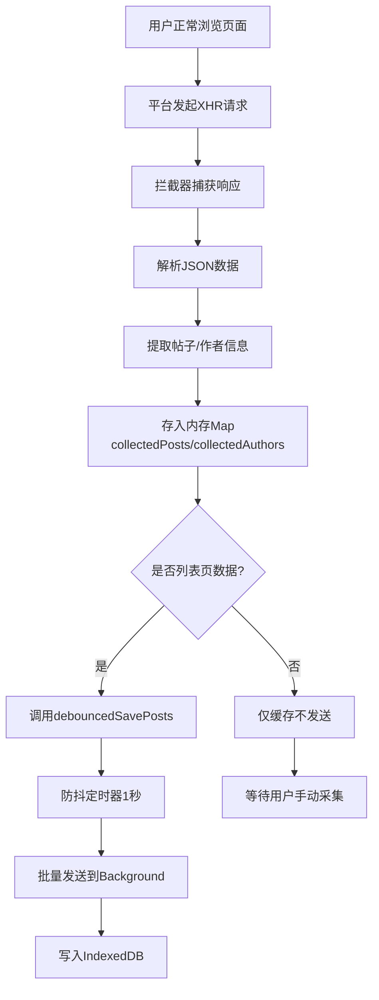
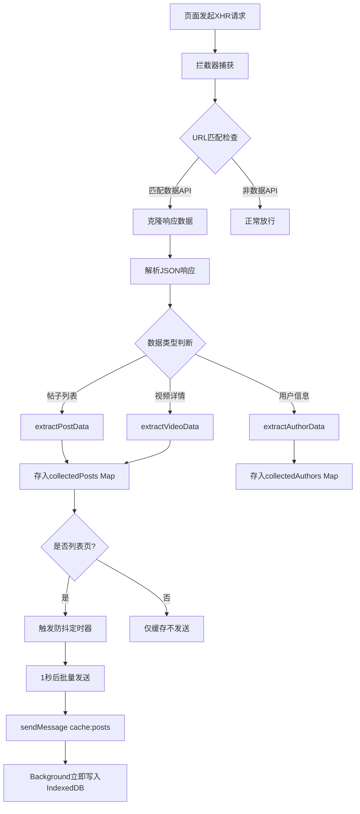

# 拦截器问题处理方案

## 1. 问题背景

在产品架构文档 `6.3 网络拦截机制` 中，提到了"防抖延迟保存"的概念。需要明确：既然是被动拦截用户正常访问的数据，为什么还需要防抖定时器？

---

## 2. 现有实现分析

### 2.1 拦截器核心流程



### 2.2 防抖定时器的实际作用

**代码位置**：`src/entrypoints/xhs.content/index.ts` (L215-L226)

```typescript
let savePostsTimer: ReturnType<typeof setTimeout> | null = null;
function debouncedSavePosts() {
  if (savePostsTimer) {
    clearTimeout(savePostsTimer);
  }
  savePostsTimer = setTimeout(() => {
    if (collectedPosts.size > 0) {
      sendMessage('cache:posts', { posts: Array.from(collectedPosts.values()) });
    }
    savePostsTimer = null;
  }, 1000);
}
```

---

## 3. 防抖定时器的真正目的

### 3.1 核心原因：批量发送优化

| 场景 | 不使用防抖 | 使用防抖 |
|-----|----------|---------|
| 用户滚动浏览列表 | 每次API请求都发送消息 | 合并为一次批量发送 |
| 消息通信次数 | N次 | 1次 |
| Background处理压力 | 高 | 低 |
| 性能影响 | 可能卡顿 | 流畅 |

### 3.2 典型场景分析

**场景1：小红书首页信息流**
```
用户滚动 → API请求1(20条) → 拦截 → 发送消息1
        → API请求2(20条) → 拦截 → 发送消息2
        → API请求3(20条) → 拦截 → 发送消息3
        → ...
```

**使用防抖后**：
```
用户滚动 → API请求1(20条) → 拦截 → 存入Map
        → API请求2(20条) → 拦截 → 存入Map
        → API请求3(20条) → 拦截 → 存入Map
        → 停止滚动1秒后 → 批量发送(60条)
```

### 3.3 防抖的三个关键作用

1. **减少消息通信开销**
   - Chrome扩展消息通信有性能开销
   - 批量发送减少通信次数

2. **避免重复数据写入**
   - 同一帖子可能出现在多个API响应中
   - Map自动去重，批量发送时只写入一次

3. **提升用户体验**
   - 减少后台处理压力
   - 避免频繁写入数据库导致卡顿

---

## 4. 架构文档问题修正

### 4.1 原文档表述问题

**原文**（产品架构.md L427-L428）：
```
H --> I[防抖延迟保存]
I --> J[发送到Background]
```

**问题**：
- "延迟保存"容易误解为延迟写入数据库
- 实际上是"延迟发送消息"，数据写入是立即的

### 4.2 修正后的流程图



---

## 5. 当前实现存在的问题

### 5.1 问题1：Map数据未清理

**现象**：
- `collectedPosts` 和 `collectedAuthors` 是全局 Map
- 数据只增不减，可能导致内存泄漏

**代码位置**：`src/entrypoints/xhs.content/index.ts` (L8-L9)

```typescript
const collectedPosts: Map<string, Partial<PostEntity>> = new Map();
const collectedAuthors: Map<string, Partial<AuthorEntity>> = new Map();
```

### 5.2 问题2：页面切换时Map未清空

**现象**：
- 用户从列表页跳转到详情页
- Map中仍保留之前列表页的数据
- 可能导致数据混淆

### 5.3 问题3：防抖时间固定

**现象**：
- 所有场景都使用1秒防抖
- 快速浏览时可能等待时间过长
- 慢速浏览时可能频繁触发

---

## 6. 优化方案

### 6.1 方案1：添加Map清理机制

```typescript
function clearCollectedData() {
  collectedPosts.clear();
  collectedAuthors.clear();
  console.log('[智联AI] 已清理缓存数据');
}

function onPageChanged(pageType: PageType) {
  console.log('[智联AI] 页面切换:', pageType);
  
  clearCollectedData();
  removeInjectedUI();
  
  setTimeout(() => {
    injectUIByPageType(pageType);
  }, 1000);
}
```

### 6.2 方案2：动态防抖时间

```typescript
function getDebounceTime(): number {
  const postCount = collectedPosts.size;
  
  if (postCount > 50) {
    return 500;
  } else if (postCount > 20) {
    return 800;
  } else {
    return 1000;
  }
}

function debouncedSavePosts() {
  if (savePostsTimer) {
    clearTimeout(savePostsTimer);
  }
  
  const delay = getDebounceTime();
  savePostsTimer = setTimeout(() => {
    if (collectedPosts.size > 0) {
      sendMessage('cache:posts', { posts: Array.from(collectedPosts.values()) });
      collectedPosts.clear();
    }
    savePostsTimer = null;
  }, delay);
}
```

### 6.3 方案3：添加数据过期机制

```typescript
interface CacheItem<T> {
  data: T;
  timestamp: number;
}

const CACHE_EXPIRE_TIME = 5 * 60 * 1000;

function setCacheItem<T>(map: Map<string, CacheItem<T>>, key: string, data: T) {
  map.set(key, {
    data,
    timestamp: Date.now()
  });
}

function cleanExpiredCache<T>(map: Map<string, CacheItem<T>>) {
  const now = Date.now();
  for (const [key, item] of map.entries()) {
    if (now - item.timestamp > CACHE_EXPIRE_TIME) {
      map.delete(key);
    }
  }
}
```

---

## 7. 实施步骤

### 7.1 第一阶段：修复核心问题

- [ ] 添加Map清理机制
- [ ] 页面切换时清空缓存
- [ ] 发送后清空已发送数据

### 7.2 第二阶段：性能优化

- [ ] 实现动态防抖时间
- [ ] 添加数据过期机制
- [ ] 优化内存使用

### 7.3 第三阶段：架构文档更新

- [ ] 修正产品架构.md中的流程图
- [ ] 明确防抖定时器的真正作用
- [ ] 补充性能优化说明

---

## 8. 总结

### 8.1 防抖定时器的本质

防抖定时器**不是**为了"延迟保存数据"，而是为了：
1. **批量发送优化**：减少消息通信次数
2. **性能优化**：降低Background处理压力
3. **数据去重**：Map自动去重，避免重复写入

### 8.2 架构设计要点

| 设计原则 | 实现方式 | 优势 |
|---------|---------|------|
| 被动采集 | XHR拦截 | 不触发反爬机制 |
| 批量处理 | 防抖定时器 | 减少通信开销 |
| 内存缓存 | Map数据结构 | 快速查找和去重 |
| 立即写入 | Background处理 | 数据不丢失 |

### 8.3 关键理解

**拦截器的工作模式**：
```
拦截 → 缓存(Map) → 防抖合并 → 批量发送 → 立即写入
```

**而不是**：
```
拦截 → 缓存 → 延迟保存 ❌
```

---

## 9. 相关代码位置

| 文件 | 行号 | 功能 |
|-----|------|------|
| src/entrypoints/xhs.content/index.ts | L215-L226 | 防抖函数定义 |
| src/entrypoints/xhs.content/index.ts | L30-L70 | XHR拦截器 |
| src/entrypoints/xhs.content/index.ts | L85-L98 | API数据处理 |
| src/entrypoints/background/index.ts | L277-L330 | 缓存数据处理 |
| 开发结果/产品架构.md | L476-L503 | 网络拦截机制流程图 |
