# 智联采集 - 产品架构设计文档

## 1. 核心设计原则

- **统一立场**：采用平台适配器模式，实现多平台数据采集的统一抽象
- **隐式与显式结合**：隐式网络拦截自动采集 + 显式用户手动采集
- **层级化架构**：表现层(UI) -> 业务逻辑层(Store) -> 数据访问层(DB) -> 平台适配层(Adapter)
- **解耦设计**：各模块独立，通过消息通信机制协作

---

## 2. 背景说明

智联采集是一款 Chrome 浏览器扩展插件，用于社媒数据采集与导出。支持小红书、抖音、快手、星图、蒲公英等多平台，实现帖子、作者、评论等数据的自动/手动采集，并支持多种格式导出。

**核心问题**：
1. 多平台数据结构差异大，需要统一抽象
2. Chrome 扩展多环境（Content Script、Background、Side Panel）通信复杂
3. 数据采集需要被动拦截，避免触发平台反爬机制

---

## 3. 系统架构图

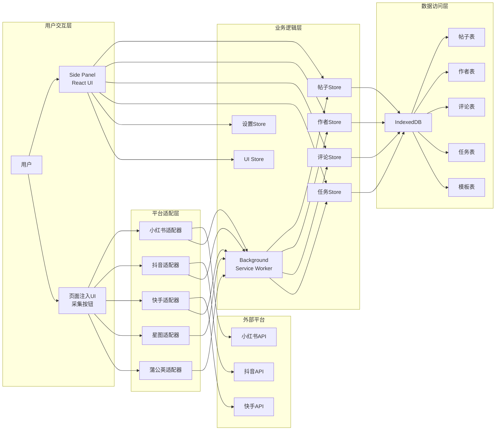

---

## 4. 数据库设计

### 4.1 ER 图

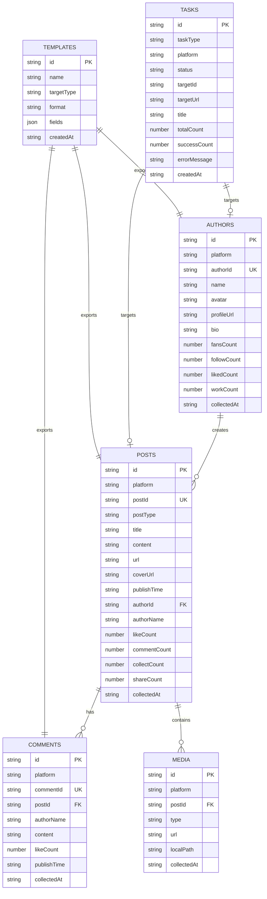

### 4.2 数据字典

#### 平台类型 (Platform)

| 值 | 中文名称 | 说明 | 域名 |
|---|---------|------|------|
| xhs | 小红书 | 小红书平台 | xiaohongshu.com |
| douyin | 抖音 | 抖音平台 | douyin.com |
| kuaishou | 快手 | 快手平台 | kuaishou.com |
| xingtu | 星图 | 巨量星图 | star.toutiao.com |
| pgy | 蒲公英 | 小红书蒲公英 | pgy.xiaohongshu.com |
| tiktok | TikTok | 国际版抖音 | tiktok.com |

#### 帖子类型 (PostType)

| 值 | 中文名称 | 说明 |
|---|---------|------|
| image | 图文 | 图片类型帖子 |
| video | 视频 | 视频类型帖子 |
| mixed | 混合 | 图文视频混合 |
| text | 纯文本 | 纯文字内容 |

#### 任务类型 (TaskType)

| 值 | 中文名称 | 说明 |
|---|---------|------|
| collect_post | 采集帖子 | 采集单个帖子数据 |
| collect_author | 采集作者 | 采集作者信息 |
| collect_comments | 采集评论 | 采集帖子评论 |
| export_data | 导出数据 | 导出数据到文件 |
| download_media | 下载媒体 | 下载图片/视频 |

#### 任务状态 (TaskStatus)

| 值 | 中文名称 | 说明 |
|---|---------|------|
| pending | 待执行 | 任务等待执行 |
| running | 执行中 | 任务正在执行 |
| success | 已成功 | 任务执行成功 |
| failed | 已失败 | 任务执行失败 |
| canceled | 已取消 | 任务被取消 |

#### 导出格式 (ExportFormat)

| 值 | 中文名称 | 说明 |
|---|---------|------|
| csv | CSV | 逗号分隔值文件 |
| excel | Excel | Excel 表格文件 |
| json | JSON | JSON 数据文件 |

---

## 5. 设计模式应用

### 5.1 适配器模式 (Adapter Pattern)

**应用场景**：多平台数据采集

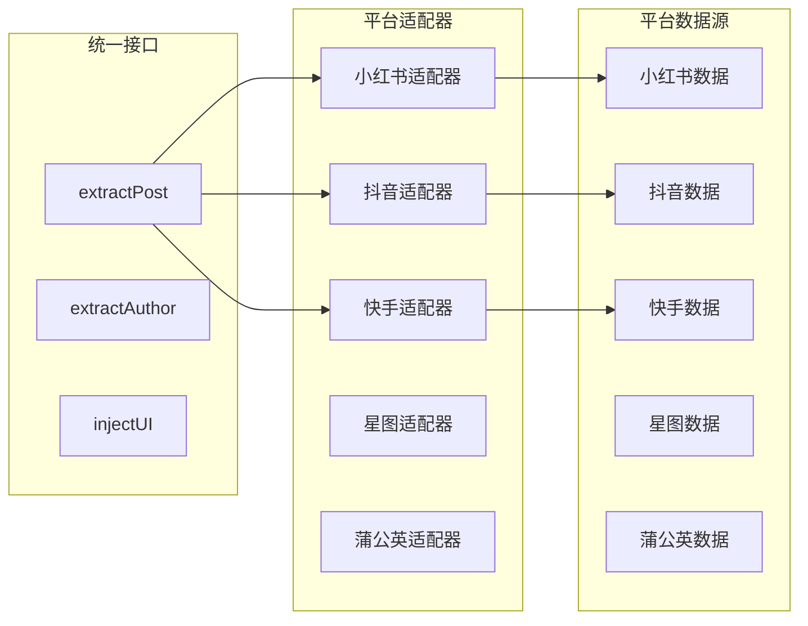

**代码示例**：

```typescript
// 平台适配器统一接口
interface PlatformAdapter {
  detectPage(url: string): PageType;
  extractPost(): Promise<ExtractResult<PostEntity>>;
  extractAuthor(): Promise<ExtractResult<AuthorEntity>>;
  injectUI(): void;
}

// 小红书适配器实现
class XHSAdapter implements PlatformAdapter {
  detectPage(url: string): PageType { /* ... */ }
  extractPost(): Promise<ExtractResult<PostEntity>> { /* ... */ }
  extractAuthor(): Promise<ExtractResult<AuthorEntity>> { /* ... */ }
  injectUI(): void { /* ... */ }
}
```

### 5.2 状态管理模式 (State Management Pattern)

**应用场景**：全局状态管理

使用 Zustand 实现响应式状态管理：

```typescript
// Store 模式
export const usePostsStore = create<PostsState>((set, get) => ({
  posts: [],
  filters: {},
  selectedIds: [],
  
  fetchPosts: async () => { /* ... */ },
  addPost: async (post) => { /* ... */ },
  deletePosts: async (ids) => { /* ... */ },
  setFilters: (filters) => { /* ... */ },
}));
```

### 5.3 观察者模式 (Observer Pattern)

**应用场景**：消息通信机制

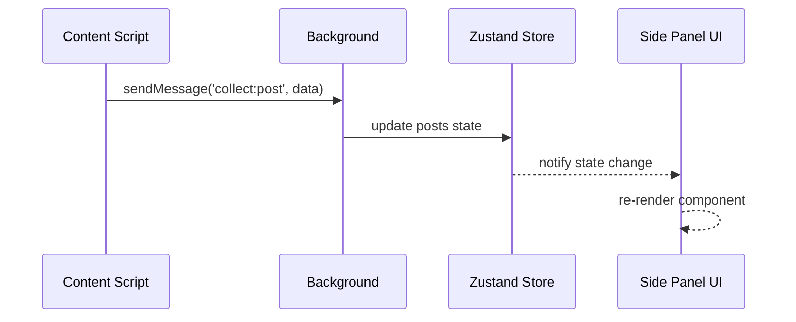

### 5.4 策略模式 (Strategy Pattern)

**应用场景**：数据提取策略

```typescript
// 多策略提取
async function extractPost(): Promise<ExtractResult<PostEntity>> {
  // 策略1：从页面状态提取
  const stateData = extractFromPageState();
  if (stateData.success) return stateData;
  
  // 策略2：从DOM提取
  const domData = extractFromDOM();
  if (domData.success) return domData;
  
  // 策略3：从网络拦截缓存提取
  const cachedData = extractFromCache();
  return cachedData;
}
```

### 5.5 单例模式 (Singleton Pattern)

**应用场景**：数据库连接、缓存管理

```typescript
// 数据库单例
let dbInstance: IDBPDatabase<ZhiLianCaiJiDB> | null = null;

export async function getDB(): Promise<IDBPDatabase<ZhiLianCaiJiDB>> {
  if (!dbInstance) {
    dbInstance = await initDB();
  }
  return dbInstance;
}
```

### 5.6 工厂模式 (Factory Pattern)

**应用场景**：任务创建

```typescript
// 任务工厂
async function createTask(type: TaskType, data: any): Promise<string> {
  const taskConfig = {
    collect_post: { taskType: 'collect_post', title: '采集帖子' },
    collect_author: { taskType: 'collect_author', title: '采集作者' },
    export_data: { taskType: 'export_data', title: '导出数据' },
  };
  
  return addTask({ ...taskConfig[type], ...data });
}
```

---

## 6. 采集业务流程

### 6.1 自动采集流程

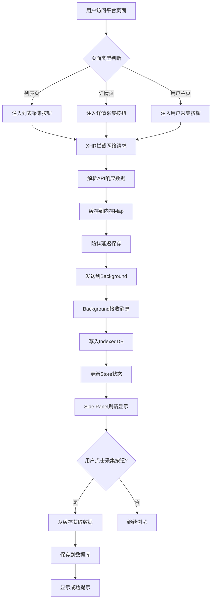

### 6.2 手动采集流程

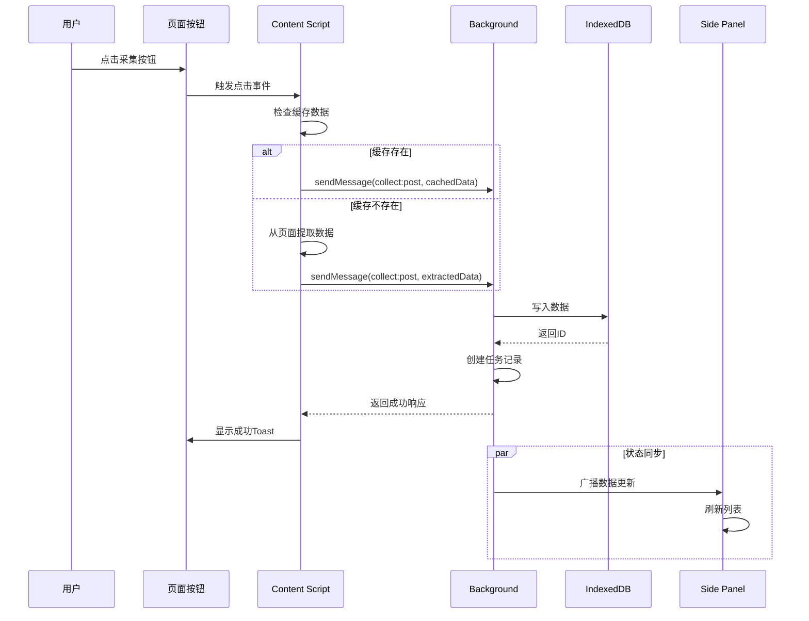

### 6.3 网络拦截机制

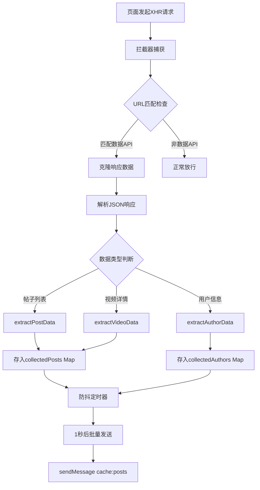

---

## 7. 模块解耦分析

### 7.1 模块依赖关系

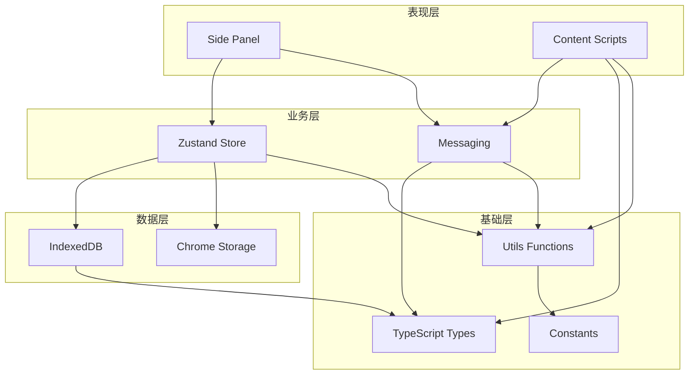

### 7.2 解耦设计要点

| 层级 | 模块 | 职责 | 依赖 |
|-----|------|------|------|
| 表现层 | Side Panel | 用户界面展示 | Store, Types |
| 表现层 | Content Scripts | 平台数据采集 | Messaging, Types |
| 业务层 | Zustand Store | 状态管理 | DB, Types |
| 业务层 | Messaging | 消息通信 | Types |
| 数据层 | IndexedDB | 数据持久化 | Types |
| 数据层 | Chrome Storage | 配置存储 | - |
| 基础层 | Types | 类型定义 | - |
| 基础层 | Utils | 工具函数 | Constants |

### 7.3 通信机制解耦

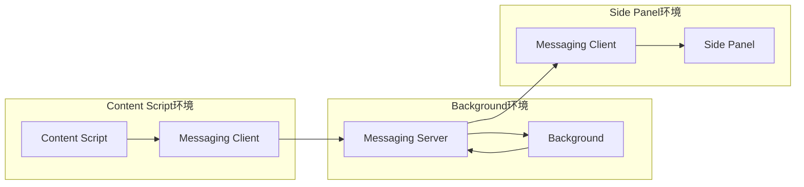

**解耦优势**：
1. 各模块通过消息通信，无直接依赖
2. 新增平台只需添加适配器，无需修改核心代码
3. 数据层变更不影响业务层
4. UI层可独立开发和测试

---

## 8. 问题定位与排查

### 8.1 采集失败排查流程

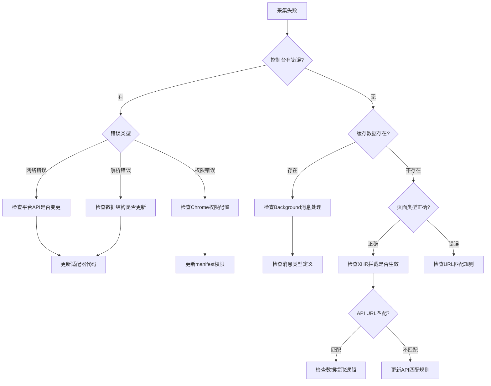

### 8.2 数据不显示排查

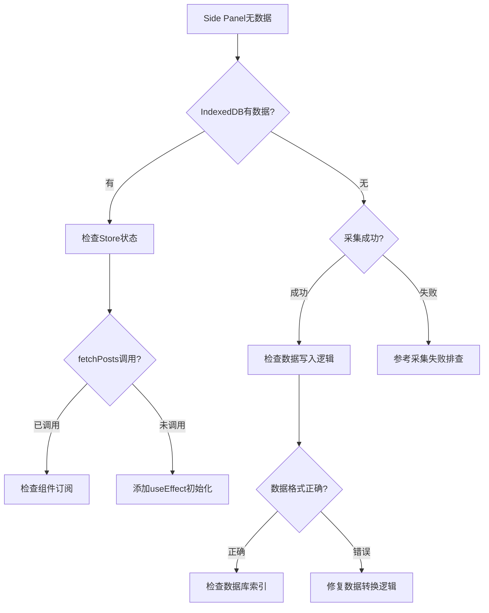

---

## 9. 统一口径定义

### 9.1 数据采集口径

| 场景 | 触发方式 | 数据来源 | 存储时机 |
|-----|---------|---------|---------|
| 列表浏览 | 自动拦截 | API响应 | 防抖1秒后 |
| 详情页浏览 | 自动拦截 | API响应 | 立即缓存 |
| 手动采集 | 点击按钮 | 缓存/页面 | 立即存储 |
| 批量采集 | 列表按钮 | 缓存数据 | 立即存储 |

### 9.2 平台适配器口径

| 平台 | 帖子ID字段 | 作者ID字段 | 互动数据字段 |
|-----|-----------|-----------|-------------|
| 小红书 | noteId | userId | interactInfo |
| 抖音 | aweme_id | uid | statistics |
| 快手 | photo.id | author.id | likeCount |
| 星图 | video_id | author_id | like_count |
| 蒲公英 | note_id | user_id | like_count |

### 9.3 消息类型口径

| 消息类型 | 发送方 | 接收方 | 数据结构 |
|---------|-------|-------|---------|
| collect:post | Content | Background | { platform, post } |
| collect:author | Content | Background | { platform, author } |
| cache:posts | Content | Background | { posts: PostEntity[] } |
| cache:author | Content | Background | { author: AuthorEntity } |

---

## 10. 扩展性设计

### 10.1 新增平台步骤

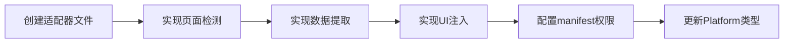

### 10.2 新增数据类型

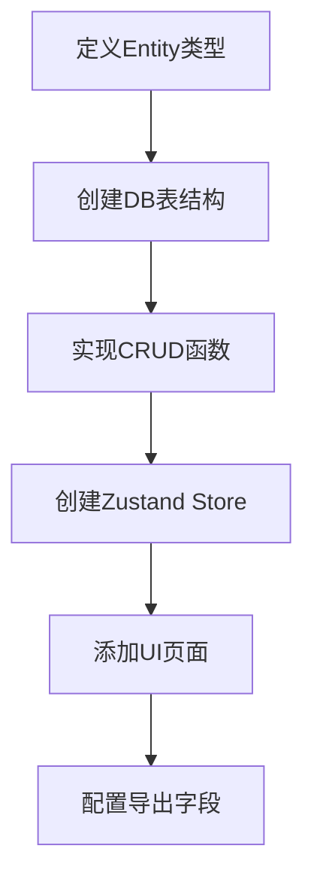

---

## 11. 技术栈总结

| 类别 | 技术选型 | 用途 |
|-----|---------|------|
| 框架 | WXT | Chrome Extension MV3 开发框架 |
| UI框架 | React 18 | 用户界面开发 |
| 状态管理 | Zustand | 轻量级状态管理 |
| 数据库 | IndexedDB (idb) | 本地数据持久化 |
| 样式 | Tailwind CSS | 原子化CSS框架 |
| 类型 | TypeScript | 类型安全 |
| 导出 | xlsx | Excel文件生成 |
| 构建 | Vite | 开发构建工具 |

---

## 12. 架构优势总结

1. **高内聚低耦合**：各模块职责单一，通过消息通信协作
2. **可扩展性强**：新增平台只需添加适配器，无需修改核心代码
3. **类型安全**：TypeScript 全覆盖，编译时发现错误
4. **响应式UI**：Zustand 状态管理，数据变化自动更新UI
5. **被动采集**：网络拦截机制，避免触发平台反爬
6. **多策略提取**：页面状态、DOM、缓存多策略保证数据获取成功率
7. **离线优先**：所有数据本地存储，无需服务器依赖
